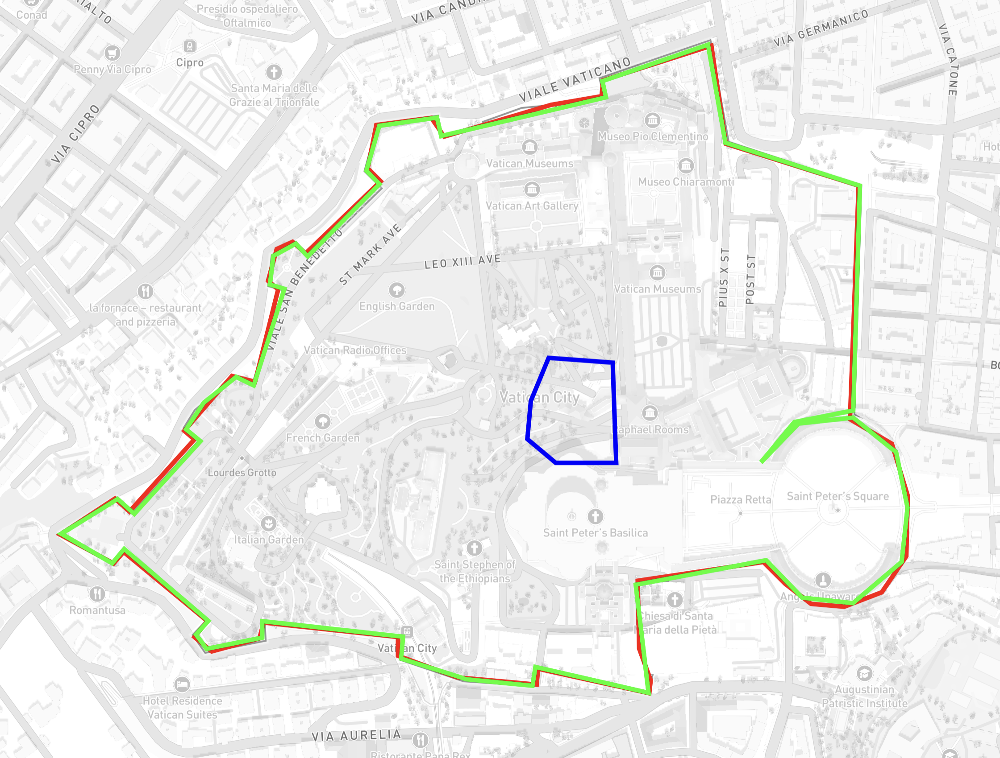

# ADR: Winding enforcement and test-data provenance

## Context

During a review of the library's public API — conducted independently using both Claude and
Mistral — both models flagged the same issue: `isStrictPolygonCoordinates` was not actually
enforcing winding direction.  Specifically, both pointed out that `isStrictExteriorRing` and
`isStrictInteriorRing` existed but were never called from the polygon guard, making
`isStrictPolygon` indistinguishable from `isPolygon` with respect to ring orientation.

This needed fixing, so I added a task: fix `isStrictPolygonCoordinates`.
On the surface a two-line change.  In practice it revealed a chain of related issues.

---

## Discovery 1 — "Strict isn't strict"

I had called `isExteriorRing` (just `isLinearRing`, no winding check) instead of `isStrictExteriorRing`.  A `Polygon` with a clockwise exterior ring passed
`isStrictPolygon` without complaint.

RFC 7946 §3.1.6 is explicit ([full text](https://www.rfc-editor.org/rfc/rfc7946#section-3.1.6)):

> A linear ring MUST follow the right-hand rule with respect to the area it bounds,
> i.e., exterior rings are counterclockwise, and holes are clockwise.

The propsed fix was correct: swap the non-strict guards for their strict equivalents in
`isStrictPolygonCoordinates`.

---

## Discovery 2 — The winding formula was wrong

After making the swap, the real-world test polygon (`Shapes.ts`) started failing
`isStrictPolygon`.  Digging into `Winding.ts` revealed the root cause:

I had implemented:

```
Σ (nx − x) · (ny + y)
```

This equals **−shoelace** — the negative of the standard shoelace formula.  The shoelace
formula gives a positive result for a counter-clockwise ring (standard cartographic
convention, RFC 7946 §3.1.6).  Because the formula was inverted, a CCW ring produced a
**negative** result, and `isCounterClockwiseWinding` (checking `>= 0`) was silently accepting
CW rings instead.

The bug was invisible because our test data used CW exterior rings —
wrong formula, wrong data, consistent with each other, tests all green.

### Proof

RFC 7946 Appendix A.3 provides canonical polygon examples.  Running those coordinates through
the formula confirmed the inversion:

| Ring | Shoelace | Winding | Code called it | RFC 7946 says |
|------|----------|---------|----------------|---------|
| Exterior `[100,0]→[101,0]→[101,1]→[100,1]→close` | +2 (CCW) | −2 | `isClockwiseWinding` ✓ | CCW exterior |
| Hole `[100.8,0.8]→[100.8,0.2]→…→close` | −0.72 (CW) | +0.72 | `isCounterClockwiseWinding` ✓ | CW hole |

These examples are now committed as regression anchors in `Winding.spec.ts`.

### Fix

Replace the formula in `Winding.ts` with the standard shoelace and restore the
comparisons to their intuitive form:

```ts
// before — (nx − x) · (ny + y) equals −shoelace, so comparisons were compensating
return carry + (nx - x) * (ny + y);

// after — standard shoelace: positive = CCW, negative = CW
return carry + (x * ny - nx * y);
```

With the correct formula the comparisons read exactly as expected:

```ts
isClockwiseWinding        → shoelace(value) <= 0   // negative = CW
isCounterClockwiseWinding → shoelace(value) >= 0   // positive = CCW
```

The internal helper was also renamed from `winding` to `shoelace` to match what it
actually computes, eliminating the ambiguity that helped the original bug hide.

---

## Discovery 3 — The Italy test data had no trustworthy provenance

The `ExteriorRing.spec.ts` and `InteriorRing.spec.ts` tests used `Italy.ts` as real-world
proof that the strict ring guards worked.  The Italy data's exterior rings had positive winding
(CW) — they passed `isCounterClockwiseWinding` under the old (broken) code, so the tests
passed.  After the fix, the same rings failed, exposing that the test data had been "correct"
only by coincidence.

Investigating the source: the git history contained no attribution comment, and the file was
three years old with no browser history to trace.  Coordinate precision (~15 significant
digits, e.g. `12.455663681030273`) suggested OSM provenance, but a web search for the exact
value returned nothing.

---

## Discovery 4 — Natural Earth also uses pre-RFC 7946 winding

Seeking a "reputable source" to replace the Italy data, the Natural Earth
`ne_10m_admin_0_countries.geojson` file was examined.  **Every polygon's exterior ring is
clockwise** — Natural Earth uses the older GJ2008 convention, which pre-dates RFC 7946 (2016).
This is a known, openly-discussed limitation: [nvkelso/natural-earth-vector#885](https://github.com/nvkelso/natural-earth-vector/issues/885)
asks exactly why the files don't comply with the right-hand rule and has received no maintainer
response.  A prior PR ([#230](https://github.com/nvkelso/natural-earth-vector/pull/230))
attempted to add RFC 7946-compliant output via `ogr2ogr -lco RFC7946=YES` but had to drop the
winding fix due to a GDAL version constraint.

This was verified with multiple online GeoJSON validators, all of which reported the data as
**valid**.  This is not a bug in those validators — RFC 7946 §3.1.6 also says parsers _SHOULD_
accept either winding for interoperability.  Virtually no public GeoJSON validator actually
enforces winding.  This is precisely the gap that `isStrictPolygon` fills.

Natural Earth was initially considered as a replacement for the missing-provenance Italy data.
It was ultimately rejected — see Decision.

---

## Discovery 5 — The old data was almost certainly OSM with Douglas–Peucker applied

After fetching fresh OSM data for Holy See (Vatican) and San Marino at full resolution and
comparing it visually with the old unknown-source data, the shapes were identical — the old
data was clearly a simplified version of the same OSM boundary.  The simplification algorithm
(visible from the way vertices were dropped while preserving shape) was consistent with
Ramer–Douglas–Peucker, which is what tools like geojson.io apply on export.

The coordinate precision confirmed this: RDP preserves the exact coordinate values of the
vertices it retains, so the remaining points in the old data had the same 15-digit OSM
precision.  No interpolation, no rounding.

---

## Decision


*Visualised with [geojson.io](https://geojson.io) — source data: `holy-see-data-comparison.json`*

The image above shows three outlines of
Vatican City side by side.  The [Natural Earth](https://www.naturalearthdata.com) polygon
(blue, 7 points) sits roughly in the centre of the other two, ~147m inside the actual
boundary — a 21% error across a country only 500m wide.  Combined with its pre-RFC 7946
CW-exterior winding, Natural Earth was unsuitable on both counts and rejected entirely.

[OpenStreetMap](https://www.openstreetmap.org) provides boundary data at sub-meter
accuracy with RFC 7946-compliant winding, verifiable by anyone via stable relation URLs.
The original unknown-source data turned out to be OSM with Ramer–Douglas–Peucker
simplification applied (Discovery 5), so switching to OSM for all test data is a return
to source with full provenance.  Italy from OSM (relation 365331) already includes Holy
See and San Marino as holes natively, so no manual hole injection is required.

### Test data strategy

All test data is sourced exclusively from [OpenStreetMap](https://www.openstreetmap.org)
and is RFC 7946-compliant throughout.

| File | OSM relation | Convention | Strict ring tests |
|---|---|---|---|
| `HolySee.ts` | [36989](https://www.openstreetmap.org/relation/36989) | CCW exterior | **pass** `isStrictExteriorRing` |
| `SanMarino.ts` | [54624](https://www.openstreetmap.org/relation/54624) | CCW exterior | **pass** `isStrictExteriorRing` |
| `Italy.ts` | [365331](https://www.openstreetmap.org/relation/365331) | CCW exterior, CW holes | **pass** `isStrictExteriorRing` + `isStrictInteriorRing` |

### Reproducibility

`scripts/update-osm-italy-test-data.mjs` regenerates all three files from scratch by
fetching each OSM relation from Nominatim at a per-feature simplification threshold tuned
to the physical size of the country.

---

## Changelog note for v2.0

> `isStrictPolygon` now correctly enforces RFC 7946 §3.1.6 winding.  Most real-world GeoJSON
> uses the older GJ2008 CW-exterior convention — Natural Earth, for example, is accepted by
> virtually every online validator yet fails the strict guards.  Use `isPolygon` /
> `isExteriorRing` if you need to accept data regardless of winding direction.
