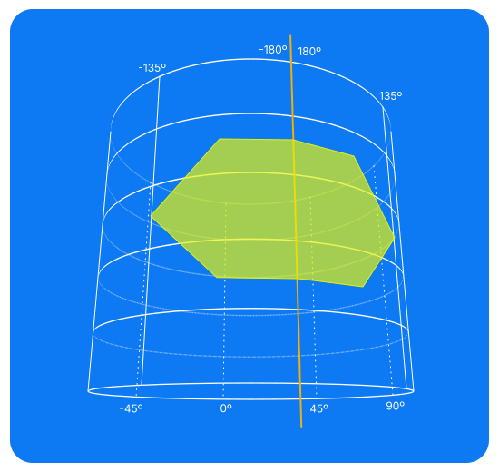

# Antimeridian-crossing geometry

RFC 7946 §3.1.9 says a geometry that crosses the antimeridian (±180° longitude) **SHOULD**
be cut into two parts (a `MultiPolygon` or `MultiLineString`) — not **MUST**. Callers are
allowed to hand this library a `Polygon` or `LineString` whose coordinates jump straight
from, say, `179°` to `-179°`. `intersect`, `distance`, and the RFC 7946 §3.1.6 winding checks
(`isStrictPolygon`, `isStrictMultiPolygon`) all handle that correctly.

## The problem

Longitude is a position on a circle, not a point on a number line. `179°` and `-179°` are
neighbours — 2° apart, sharing a fence — but plain subtraction doesn't know that:
`-179 - 179 = -358`. To arithmetic, two people leaning over the garden fence are "almost all
the way around the world apart." Every piece of math this library uses internally — the
shoelace formula (winding), ray-casting (point-in-ring), 2D line-segment intersection —
assumes flat-plane coordinates where subtraction means distance. None of it knows longitude
wraps.



This is the mental model, not literally how positions are stored — just a way to picture
*why* `179°` and `-179°` are neighbours instead of 358° apart: wrap the longitude axis into
a circle, and a shape sitting across the seam is completely unremarkable. The trouble starts
once that circle gets unrolled flat to do the actual math.


Cut the cylinder at the seam and lay it flat, and this is what you get: the dashed outline
is where you'd expect the shape to sit, but the raw coordinates draw the rust-coloured ribbon
instead — two real fragments of the shape stranded at the two edges of the tile, joined by
two edges that wrongly sweep almost the entire width in between.

The fix is to stop treating `-180°..180°` as the only tile there is. Longitude repeats every
360°, like a strip of wallpaper — so tile a second copy right after the first (dotted,
`180°` to `270°`) and let the vertices that jumped keep counting up instead of wrapping back
to `-180°`. `-179°` becomes `181°`: not a new position, just the same point written on the
next copy of the pattern. Read that way, the two stranded fragments turn out to have been
adjacent all along — the lime shape on the right.

## A concrete failure

Take a real case: a line hopping ~2° across the dateline, `a = [[179, -1], [-179, 1]]`,
checked against a line at longitude `0`, `b = [[0, -1], [0, 1]]`, nowhere near it.

Segment intersection parametrizes `a` as a straight line between its raw coordinates:
`x(t) = 179 + t·(-179 - 179) = 179 - 358t`. At `t = 0.5`, `x = 0, y = 0` — the formula finds
a crossing at the origin, exactly where `b` sits. The math isn't broken; it's answering
correctly for the line it was given. The line is just wrong: `179 - 358t` sweeps all the way
through `0°`, but the true short hop from `179°` to `-179°` never goes anywhere near it.

## The fix: unwrapping

Longitude jumps of more than 180° between consecutive vertices are the tell that the "short
way" actually runs the other direction around the circle. `unwrapPath`
(`source/Domain/Utility/Antimeridian.ts`) walks a ring or line and adds ±360° after every such
jump, so the path stops wrapping and becomes continuous instead:

```
(179, -1)  → offset 0            → (179, -1)
(-179, 1)  → jump = -179-179     → offset becomes +360
             = -358 (< -180)     → (-179 + 360, 1) = (181, 1)
```

`a` becomes `[(179, -1), (181, 1)]`. That's not a different geometry — `181°` longitude *is*
`-179°`, just written one lap further around instead of wrapping back to `-180°`. Relabelling
a point by an exact multiple of 360° can't move it, because every downstream formula
(shoelace, ray-cast, segment intersection) only ever looks at *differences* between points,
never at a point's absolute value in some fixed frame. The only thing that mattered was
making sure two points that are close on the globe are also close in the numbers handed to
the formula.

With `a` unwrapped, the line from `(179,-1)` to `(181,1)` never comes near `x = 0`, and
segment intersection — completely unchanged, no special-casing — correctly reports no
crossing.[^1] Sometimes the cheapest fix is rearranging the inputs rather than rewriting the
formula.

(The threshold is a strict `> 180°` / `< -180°`, so a jump of exactly `180°` is left alone —
both directions around the circle are equally short, so there's nothing to prefer.)

This ±180° threshold is a guess about intent, and it's an inherently ambiguous one: from two
raw coordinates alone, there's no way to tell a genuine dateline hop apart from a segment
that's deliberately more than half the globe wide. That ambiguity isn't something unwrapping
introduces — cutting tools, including the `antimeridian` package referenced below, use this
same >180° heuristic to decide where a crossing is, so they inherit the identical blind spot.

## Comparing two independently-unwrapped paths: `alignPath`

`unwrapPath` only guarantees a *single* path is internally consistent — each point close to
its own neighbour. It says nothing about how that path relates to a *different* path. In the
example above, `a` ended up shifted by `+360` purely because it happened to contain a jump;
`b` never had one, so it stayed at `+0`. Both are internally fine, but by accident they're
sitting on different "copies" of the repeating map — like two guests who each got a
perfectly reasonable room, in different wings of a rather large hotel.

`alignPath` fixes that for the two-path case: it finds the representative of the second
path's first point that is closest to the first path's first point, and shifts the *whole*
second path by that one offset. Because the second path is already internally consistent (no
jumps of its own), shifting it as a rigid block can't reintroduce one — it just chooses which
repeated copy of the world to draw it on: whichever one sits nearest the first path.

This assumes the two paths are candidates for the same check to begin with (the two sides of
an `intersect`/`distance` call). Nothing stops `alignPath` from being called on two genuinely
unrelated paths — it will still pick *a* nearest copy and return a confident-looking result —
but "nearest" only means anything when there was a real spatial relationship to recover in the
first place.

## Why this over cutting?

RFC 7946 §3.1.9 and tools like the [`antimeridian`](https://www.gadom.ski/antimeridian/latest/the-algorithm/)
package solve a related but different problem: producing a valid, cut `MultiPolygon` /
`MultiLineString` representation of a crossing geometry — useful for renderers that don't
handle antimeridian-crossing shapes. That requires detecting each crossing, inserting a
vertex exactly at ±180°, splitting into pieces, and — trickiest of all — a special case for
rings that enclose a pole.

This library doesn't need any of that to make `intersect`, `distance`, and the winding checks
correct: unwrapping and aligning is mathematically equivalent to cutting for every case that
doesn't enclose a pole, at a fraction of the code, and it sidesteps a circular dependency
cutting has — pole-handling needs to know the ring's winding direction first, but correct
winding-direction detection is one of the things being fixed here.

A public cutting/normalizing utility (splitting into a `MultiPolygon`, auto-correcting
winding, wrapping out-of-range coordinates) is a legitimate, separate feature — tracked apart
from this fix rather than folded into it.

## Where it's used

- `Winding.ts` — `shoelace` unwraps before summing, so ring winding direction (RFC 7946
  §3.1.6) is classified correctly even when the ring straddles the antimeridian.
- `Calculate.ts` — `isLinesCrossing`, `isPointInRing`, and `getClosestPointOnLineByPoint` all
  unwrap/align their inputs before running the flat-plane formulas.

[^1]: Strictly speaking, it's not even that dramatic a failure in this toy case. Two segments
  crossing at the origin is only one wrong answer; the interesting real-world cases involve
  polygons where winding and containment quietly go sideways along an entire seam. Same
  cause, bigger blast radius.
